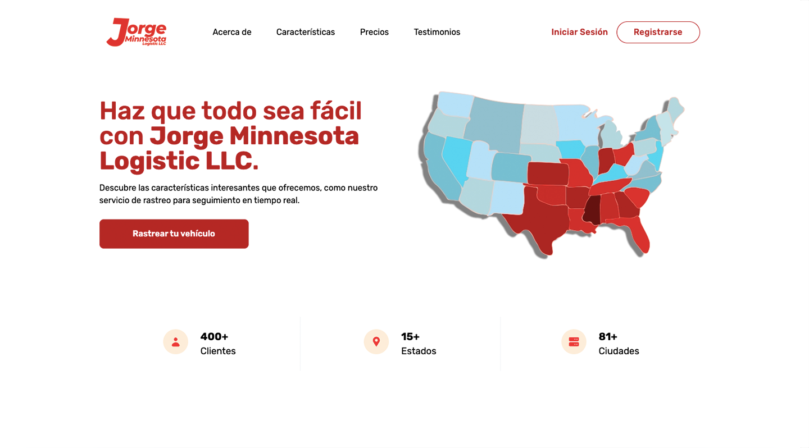

# [Tailwind Jorge Minnesota Logistic LLC Landingpage](https://next-landing-vpn.vercel.app/) - Free Landingpage Template Apps

Tailwind Jorge Minnesota Logistic LLC Landingpage is an open source, apps landing page template for [Tailwind CSS](https://tailwindcss.com/) and[ NextJS](nextjs.org/) coded by [Faldi](twitter.com/f2aldi) and design from [Didi](https://twitter.com/didiikurniawann).

## Getting Started

Choose one of the following options to get started:

- [Download the latest release](https://github.com/naufaldi/next-landing-vpn/archive/main.zip)
- Clone the repo: `git clone https://github.com/naufaldi/next-landing-vpn.git`
- Fork the repo

## About the Template

- Template building using NextJS Version 10
- Tailwind v2.0

## Feature Template

- Using [NextJS Image](https://nextjs.org/docs/api-reference/next/image) for Image Optimization
- Slider using [React Slick](https://react-slick.neostack.com/docs/api)
- Smooth Scrolling and Active menu using [React Scroll](https://www.npmjs.com/package/react-scroll)

## Bugs and Issues

Have a bug or an issue with this template? [Open a new issue](https://github.com/naufaldi/next-landing-vpn/issues/new) here on GitHub.

## Creator

[Tailwind Jorge Minnesota Logistic LLC Landingpage](https://next-landing-vpn.vercel.app/) was coded and modified by and is maintained by **[me](https://github.com/naufaldi/)**, and dekstop design by [Didi Kurniawan](https://twitter.com/didiikurniawann)

## Copyright and License

Code released under the MIT license.

## To Do List Add Feature

- [ ] Animation using Framer Motion

├── 📁 components/
│   ├── 📁 BuscaVehiculo/
│   │   ├── BuscaVehiculo.js
│   │   └── Rastreo.js
│   ├── 📁 Catalogo/
│   │   ├── Catalogo.js
│   │   └── cardsCatalogo.js
│   ├── 📁 Choferes/
│   │   ├── Choferes.js
│   │   ├── FormChofer.js
│   │   └── TablaChoferes.js
│   ├── 📁 Clientes/
│   │   ├── Clientes.js
│   │   ├── FormCliente.js
│   │   └── TablaClientes.js
│   ├── 📁 Cobranza/
│   │   ├── Cobranza.js
│   │   ├── PagosPendientes.js
│   │   └── ReciboPP.js
│   ├── 📁 CorteDia/
│   │   ├── CorteDia.js
│   │   ├── TablaEntradas.js
│   │   ├── TablaSalidas.js
│   │   └── TablaVehiculos.js
│   ├── 📁 CorteGeneral/
│   │   ├── CorteTotal.js
│   │   ├── TablaEntradas.js
│   │   ├── TablaSalidas.js
│   │   ├── TablaVehiculos.js
│   │   └── TablaVehiculosPendientes.js
│   ├── 📁 EliminaERC/
│   │   └── EliminarMovimientosERC.js
│   ├── 📁 EliminaVehiculos/
│   │   ├── EliminaVehiculos.js
│   │   └── useBusquedaMovimientos.js
│   ├── 📁 Empresas/
│   │   ├── Empresas.js
│   │   ├── FormEmpresa.js
│   │   └── TablaEmpresas.js
│   ├── 📁 EntradaCaja/
│   │   ├── EntradaCaja.js
│   │   ├── OperacionEntrada.js
│   │   └── Recibo.js
│   ├── 📁 EstadosPrecios/
│   │   ├── EditarEstadosPrecios.js
│   │   ├── EstadosPrecios.js
│   │   ├── FormEstadosPrecios.js
│   │   └── TablaEstadoPrecios.js
│   ├── 📁 Layout/
│   │   ├── Footer.js
│   │   ├── Header.js
│   │   ├── HeaderPanel.js
│   │   ├── Layout.js
│   │   ├── ScrollAnimationWrapper.jsx
│   │   └── Sidebar.js
│   ├── 📁 Login/
│   │   ├── FormLogin.js
│   │   ├── FormRecuperaContrasena.js
│   │   ├── FormRegistro.js
│   │   └── Login.js
│   ├── 📁 MisViajes/
│   │   ├── ConsultaMisViajes.js
│   │   └── Vehiculo.js
│   ├── 📁 Reports/
│   │   ├── ReportPendientesPago.js
│   │   ├── ReporteCobros.js
│   │   └── Reports.js
│   ├── 📁 SalidaCaja/
│   │   ├── OperacionSalida.js
│   │   ├── ReciboPago.js
│   │   └── SalidaCaja.js
│   ├── 📁 SalidaVehiculo/
│   │   ├── BuscarVehiculo.js
│   │   ├── Cobrar.js
│   │   ├── ImprimeSalida.js
│   │   ├── ImprimeSalidaSinPendientes.js
│   │   ├── Pagado.js
│   │   ├── PagoCaja.js
│   │   ├── PagoPendiente.js
│   │   ├── SalidaSinPago.js
│   │   └── SalidaVehiculo.js
│   ├── 📁 Users/
│   │   └── Users.js
│   ├── 📁 Vehiculos/
│   │   ├── EntregadoVehiculo.js
│   │   ├── FormDatosVehiculo.js
│   │   ├── FormEditarVehiculo.js
│   │   ├── TablaVehiculo.js
│   │   ├── Vehiculos.js
│   │   └── VehiculosTable.js
│   ├── 📁 Viajes/
│   │   ├── FormViaje.js
│   │   ├── HojaChofer.js
│   │   ├── HojaVerificacion.js
│   │   ├── ModalLiquidacion.js
│   │   ├── ReciboPago.js
│   │   ├── TablaViajes.js
│   │   └── Viajes.js
│   └── 📁 misc/
│       ├── ButtonOutline..js
│       ├── ButtonPrimary.js
│       ├── ImputAutoEstados.js
│       ├── AccesAdmin.js
│       ├── Admin.js
│       ├── Feature.js
│       ├── Hero.js
│       ├── Pricing.js
│       ├── SeoHead.js
│       └── Testimoni.js
├── 📁 context/
│   └── auth.js
├── 📁 firebase/
│   └── firebaseIni.js
├── 📁 pages/
│   ├── _app.js
│   ├── _document.js
│   ├── admin.js
│   ├── carriers.js
│   ├── index.js
│   ├── login.js
│   ├── misviajes.js
│   └── rastreo.js
├── 📁 public/
│   ├── 📁 assets/
│   ├── 📁 favicon/
│   └── site.webmanifest
├── 📁 styles/
│   ├── slick.css
│   └── tailwind.css
├── 📁 utils/
│   └── getScrollAnimation.js
├── .gitignore
├── LICENSE
├── README.md
├── landingpage.png
├── package-lock.json
├── package.json
├── postcss.config.js
└── tailwind.config.js
